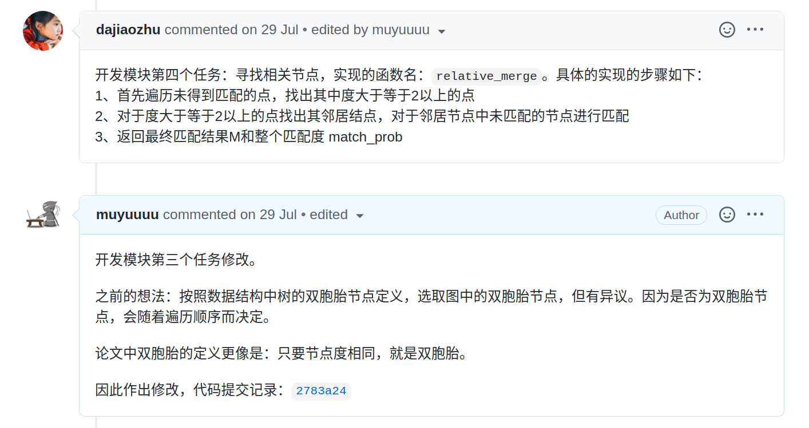

# 简介

一种大规模图的融合算法，即：将一个大图融合成一个便于处理的小图。论文地址：http://glaros.dtc.umn.edu/gkhome/node/1186 ，使用`python`和`graph-tool`复现了论文的第四章算法。

和我可爱且聪明的[师姐](https://github.com/dajiaozhu)一起开发的(其余工作正在进行中，原仓库目前不便开源，所以这里没有显示她是贡献者)。她在双胞胎处理、亲戚节点处理、图融合上提出了关键性想法，使得程序圆满开发成功。

这也是我第一次在`github`上和他人一起协作，使用`issue`和`milestone`记录开发流程，还挺爽。

代码在`Algorithm`文件夹下，数据请自己下载并放到对应位置，太大了我就不传上来了。

# 依赖

- `python: 3.7`
- `graph-tool: 2.35`(建议用`conda`安装)

# 结果

能将[上万节点的图](http://networkrepository.com/email-EU.php)处理成如下所示的模样：

融合到100个节点：

融合到7个节点：

# 实现步骤

文档地址：https://muyuuuu.github.io/2020/11/20/Metis/

开发详细流程、思想、数据结构的使用都放到博客里面了。开发程序的过程中，使用了大量数据结构的使用和程序的设计技巧，如桶排序、哈系、队列、列表、字典的花式操作来降低算法时间和空间复杂度。如果不是非要用`Metis`算法和抱着必死的决心一定要读懂代码，请谨慎观看博客和代码，直接调用即可。
