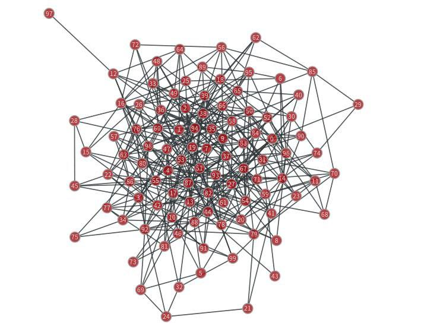
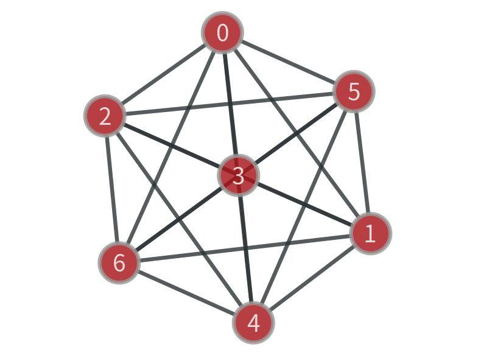
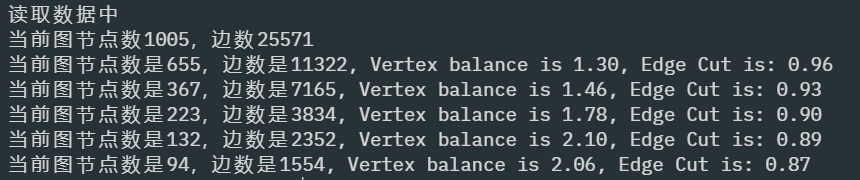

[简体中文](https://github.com/muyuuuu/Graph-Aggregation-by-Metis/blob/main/README-zh-cn.md)|[English](https://github.com/muyuuuu/Graph-Aggregation-by-Metis/blob/main/README.md)

# Introduction

An algorithm of huge graph aggregation based on metis. You can download the paper [here](http://glaros.dtc.umn.edu/gkhome/node/1186).

Developing this algorithm with my [partner](https://github.com/dajiaozhu), who has proposed some effective ideas about finding twins, finding relatives and contraction. The original repository will be opened until the paper is published, therefore she is not a contributor in this repository.

- Algorithm: The python code of algorithm.
- compare: Performance comparison with current libraries.

# Environment

- `python: 3.6`
- `graph-tool: 2.33`( recommend install it by`conda`)

## The environment of the compared algorithm 

- `networkx: 2.3`
- `metis: 0.2a4`
- `pymetis: 2020.1`

# Results

Process the [graph](http://networkrepository.com/email-EU.php) with tens of thousands of nodes as follows:

Contract to one hundred nodes: 

Contract to seven nodes: 

## Print the radio of load balance and edge cut

After one contract phase, we can print the load balance and edge cut:

# Performance

Our algorithm is better than [metis](https://metis.readthedocs.io/en/latest/) and slower than [pymetis](https://github.com/inducer/pymetis), [here](https://muyuuuu.github.io/2020/11/20/Metis/) is more details.

# Document of how to implement

You can find the [document](https://muyuuuu.github.io/2020/11/20/Metis/) about how to implement this algorithm. We use some data structures and programming skills to decrease time and space complexity such as bucket, hash, queue, list and dictionary.
